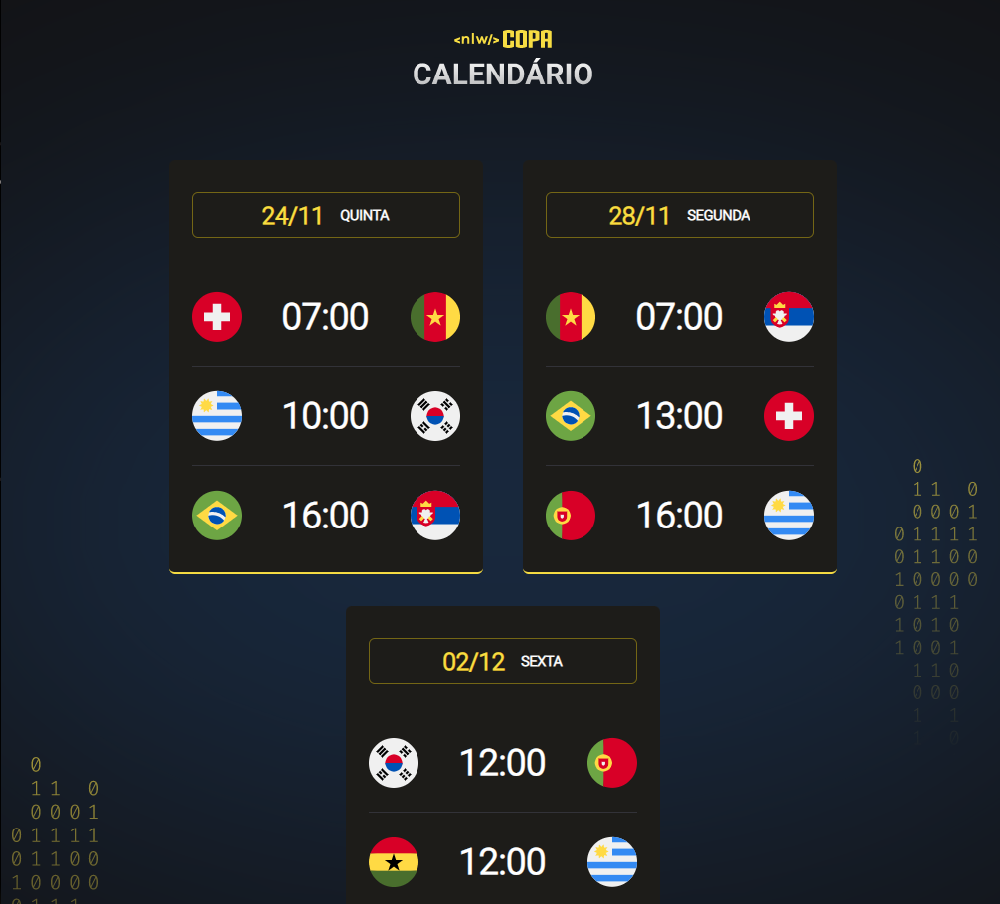

# NLW Copa 
>Trilha Explorer

 Projeto criado para o evento NLW Copa 2022 da Rocketseat, onde mostra o calendário dos jogos já definidos.

 

### 📎[Acesse aqui](https://nicoletsingas.github.io/NLW-Copa-Explorer/)

 
 

## 🛠 Tecnologias 

- HTML

- CSS

- Java Script

- Git e Github

 
 

## ✨Contato

nick_monalisa@outlook.com